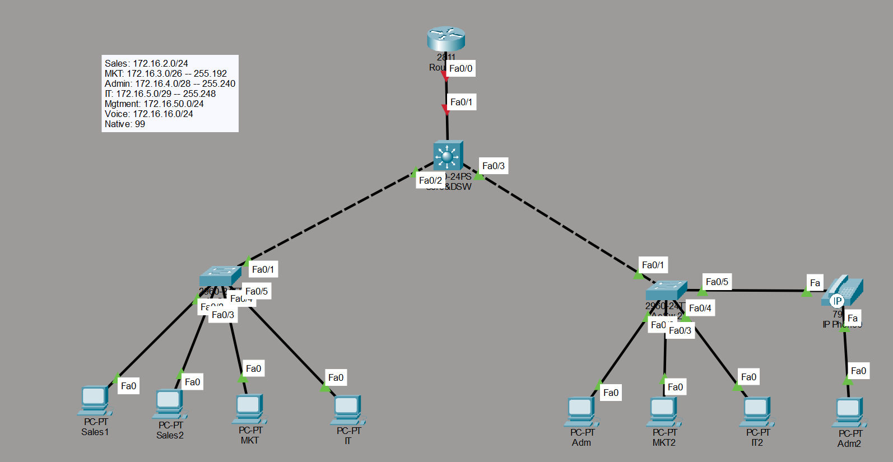

# Multi-VLAN Enterprise Network with Inter-VLAN Routing (SVI)

A Cisco Packet Tracer project simulating a small enterprise LAN with department-based VLAN segmentation, 802.1Q trunking, and inter-VLAN routing performed via Switched Virtual Interfaces (SVIs) on a Layer 3 core switch.

 

---

## 📋 Project Overview

This project simulates a small business network with multiple departments, each isolated on its own VLAN for security and broadcast-domain control, while still able to communicate with each other through routing at Layer 3. It also includes a dedicated Voice VLAN for IP telephony and a Management VLAN for out-of-band device administration.

**Key objective:** demonstrate VLAN segmentation, trunking between access and core switches, and inter-VLAN routing using SVIs (Router-on-a-Stick is *not* used here — routing is done directly on the Layer 3 core switch).

---

## 🗺️ Network Topology


*Figure 1: Logical topology showing the core switch, access switches, router, and end devices.*

```
                          ┌────────────────┐
                          │   Router 2811  │
                          └───────┬────────┘
                                  │ Fa0/0
                                  │
                          ┌───────┴────────┐
                          │  Core & DSW    │
                          │  (3560-24PS)   │
                          │  L3 Switch     │
                          └───┬────────┬───┘
                    Fa0/2     │        │     Fa0/3
                    ┌─────────┘        └─────────┐
                    │                             │
             ┌──────┴──────┐              ┌───────┴──────┐
             │    AcSw1     │              │    AcSw2     │
             │ (2960-24TT)  │              │ (2960-24TT)  │
             └──┬───┬───┬───┘              └──┬───┬───┬───┘
                │   │   │                     │   │   │
             Sales1 │  IT                  Adm  MKT2  IT2
             Sales2 MKT                        Adm2  IP Phone
```

| Device       | Model        | Role                                    |
|--------------|--------------|------------------------------------------|
| Router       | 2811         | Edge/gateway router                      |
| Core&DSW     | 3560-24PS    | Layer 3 core switch — inter-VLAN routing |
| AcSw1        | 2960-24TT    | Access switch — Sales, Marketing, IT     |
| AcSw2        | 2960-24TT    | Access switch — Admin, Marketing, IT, Voice |

---

## 🔢 VLAN & IP Addressing Scheme

| VLAN ID | Name       | Subnet             | Subnet Mask       | Gateway (SVI)   |
|---------|------------|---------------------|--------------------|------------------|
| 2       | Sales      | 172.16.2.0/24        | 255.255.255.0       | 172.16.2.1       |
| 3       | Marketing  | 172.16.3.0/26        | 255.255.255.192     | 172.16.3.1       |
| 4       | Admin      | 172.16.4.0/28        | 255.255.255.240     | 172.16.4.1       |
| 5       | IT         | 172.16.5.0/29        | 255.255.255.248     | 172.16.5.1       |
| 16      | Voice      | 172.16.16.0/24       | 255.255.255.0       | 172.16.16.1      |
| 50      | Management | 172.16.50.0/24       | 255.255.255.0       | 172.16.50.1      |
| 99      | Native     | (trunk native VLAN, no host traffic)      |

Subnet sizes are deliberately variable (VLSM) to match realistic department headcounts — Admin and IT get small subnets, Sales gets a full /24.

---

## ⚙️ Key Configuration

### 1. VLAN creation (on all switches)
```
vlan 2
 name Sales
vlan 3
 name Marketing
vlan 4
 name Admin
vlan 5
 name IT
vlan 16
 name Voice
vlan 50
 name Management
vlan 99
 name Native
```

### 2. Access ports (example — AcSw1)
```
interface FastEthernet0/2
 switchport mode access
 switchport access vlan 2
!
interface FastEthernet0/4
 switchport mode access
 switchport access vlan 3
!
interface FastEthernet0/5
 switchport mode access
 switchport access vlan 5
```

### 3. Voice VLAN port (AcSw2, port with IP Phone + daisy-chained PC)
```
interface FastEthernet0/5
 switchport mode access
 switchport access vlan 4
 switchport voice vlan 16
```

### 4. Trunk ports (Core&DSW ↔ AcSw1 / AcSw2)
```
interface FastEthernet0/2
 switchport trunk encapsulation dot1q
 switchport mode trunk
 switchport trunk native vlan 99
 switchport trunk allowed vlan 2,3,4,5,16,50,99
```

### 5. Inter-VLAN routing via SVI (on Core&DSW — the Layer 3 switch)
```
ip routing
!
interface Vlan2
 ip address 172.16.2.1 255.255.255.0
!
interface Vlan3
 ip address 172.16.3.1 255.255.255.192
!
interface Vlan4
 ip address 172.16.4.1 255.255.255.240
!
interface Vlan5
 ip address 172.16.5.1 255.255.255.248
!
interface Vlan16
 ip address 172.16.16.1 255.255.255.0
!
interface Vlan50
 ip address 172.16.50.1 255.255.255.0
```

> **Note:** `ip routing` must be explicitly enabled on the 3560 — it is disabled by default even on Layer 3-capable switches.

---

## ✅ Verification

**VLAN database consistency** — confirmed identical across Core&DSW, AcSw1, and AcSw2 via `show vlan brief`.

**SVIs up and routing** — `show ip route` on Core&DSW shows all six VLAN subnets as directly connected:
```
C    172.16.2.0/24 is directly connected, Vlan2
C    172.16.3.0/26 is directly connected, Vlan3
C    172.16.4.0/28 is directly connected, Vlan4
C    172.16.5.0/29 is directly connected, Vlan5
C    172.16.16.0/24 is directly connected, Vlan16
C    172.16.50.0/24 is directly connected, Vlan50
```

**Trunking verified** — `show interfaces trunk` on both access switches confirms 802.1Q trunking is active, native VLAN is correctly set to **99** on all trunk links, and allowed VLANs are correctly propagated.

**End-to-end reachability** — tested via ICMP (ping) between hosts in different VLANs (e.g., Sales1 → Admin, Sales1 → Admin2), confirmed in the Packet Tracer PDU list.

---

## 🔒 Security Hardening

The trunk links initially defaulted to native VLAN 1 (the out-of-the-box default), which is a known security risk — it leaves trunks exposed to VLAN-hopping attacks (e.g., double-tagging exploits) and mixes untagged management traffic with a well-known, commonly targeted VLAN.

This was remediated by:
1. Creating VLAN 99 (`name Native`) on Core&DSW, AcSw1, and AcSw2.
2. Applying `switchport trunk native vlan 99` on every trunk interface.
3. Re-verifying with `show interfaces trunk` to confirm native VLAN mismatches were resolved and no CDP native VLAN warnings remained.

This is a standard hardening step in real-world deployments and demonstrates awareness of Layer 2 security best practices beyond basic VLAN/trunk setup.

---

## 🎯 Skills Demonstrated

- VLAN creation, naming, and port assignment
- 802.1Q trunk configuration between switches
- Inter-VLAN routing via SVI on a Layer 3 switch (no router-on-a-stick)
- Voice VLAN configuration for IP telephony
- VLSM subnetting for department-based IP addressing
- Network verification using `show vlan brief`, `show ip route`, `show interfaces trunk`, and ICMP testing
- Layer 2 security hardening — identifying and remediating a native VLAN misconfiguration (changed from default VLAN 1 to a dedicated VLAN 99)

---

## 📂 Files

| File          | Description                          |
|---------------|----------------------------------------|
| `VLAN1.pkt`   | Cisco Packet Tracer project file       |
| `README.md`   | This documentation                     |

---

## 🛠️ Tools Used

- Cisco Packet Tracer (v8.x)
- Cisco IOS 12.2(37)SE1 (3560) / 15.0 (2960)

---

## 📌 How to Open

1. Install [Cisco Packet Tracer](https://www.netacad.com/courses/packet-tracer) (free with a Cisco Networking Academy account).
2. Open `VLAN1.pkt`.
3. Switch between **Logical** and **Physical** workspace views to explore topology and cabling.
4. Use **Simulation Mode** to step through ICMP packets and observe inter-VLAN routing in action.
